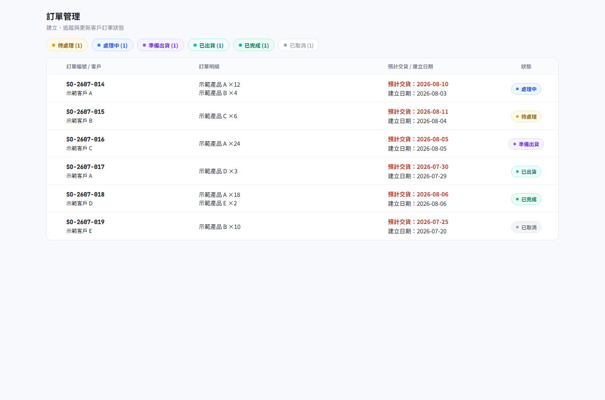
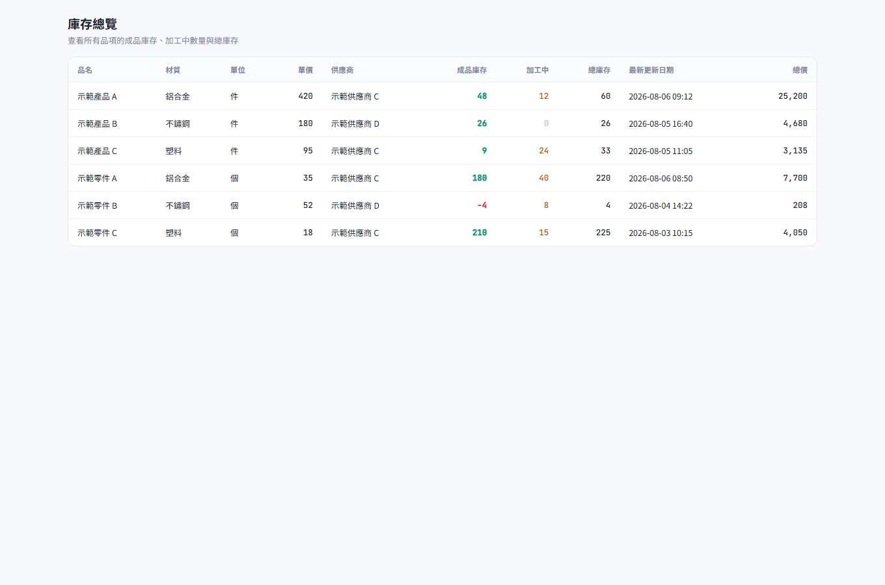

# Production Inventory Management System - Case Study

The image above is a faithful, anonymized rendering of the real application's home screen: the same six navigation groups, the same colors, and the same Traditional Chinese module labels, with the company name and all figures replaced by fictional placeholders. Two more screens rendered the same way:

| Orders | Inventory |
|--------|-----------|
|  |  |

An interactive English demo that mirrors the same module structure is also available in `demo.html`:

## Status

Deployed and used by a company. The complete source code and production configuration are private.

## Problem

The system coordinates sales orders, purchasing, inbound and outbound stock, shipping schedules, production steps, customer statements, and master data in one operational workflow.

## Engineering Scope

- Role-aware navigation and protected workflows
- Inventory movement and stock-level tracking (finished stock vs. in-process stock)
- Sales orders with a six-state status flow, purchase orders with a five-state status flow, shipping, and statements
- Product, part, customer, and supplier master data
- Process tracking and refurbishment (renewal) workflows
- Printable purchase orders, sales invoices, and statement reports

## Application Modules

The production application has 21 routed modules organized into six navigation groups:

| Group | Modules |
|-------|---------|
| Orders & Sales | Orders, Shipping, Shipping Calendar, Statements |
| Purchasing & Production | Purchase Orders, Renewals, Process Tracking |
| Warehouse | Stock In, Stock Out, Inventory |
| Query | Stock In Query, Stock Out Query, Inventory Query |
| Master Data | Products, Parts, Customers, Suppliers |
| System Settings | Materials, Process Steps, Recipients, Stock-Out Reasons |

Each module includes list, create, and edit workflows with validation; query modules provide filtered, read-focused views of the same data. Orders carry a six-state status (Pending → Processing → Preparing to Ship → Shipped → Completed, or Cancelled); purchase orders carry a five-state status (Draft → Sent → Partially Arrived → Arrived, or Cancelled) with a further in-progress/completed distinction once parts arrive and enter production.

## Technical Summary

The private application uses Next.js, React, TypeScript, server-side actions, structured data access, and responsive operational interfaces.

## Public Demo

Open `demo.html`. It is interactive and offline, restructured to match the real application: the same six groups switch between the same 21 modules, every list supports search and filtering, and selecting a row opens its detail. Every company name, customer, supplier, item, quantity, and reference number is fictional, and no network request is made.

## Why the Source Is Private

This repository intentionally excludes production code, business-specific rules, deployment history, credentials, databases, and company data. Additional source review can be discussed during an interview when appropriate and authorized.
