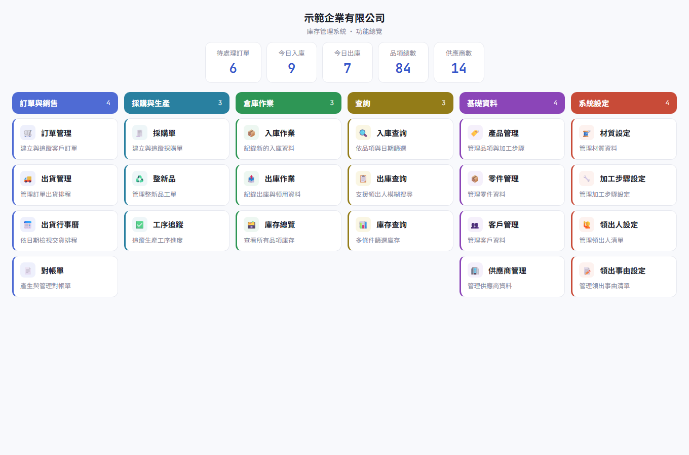
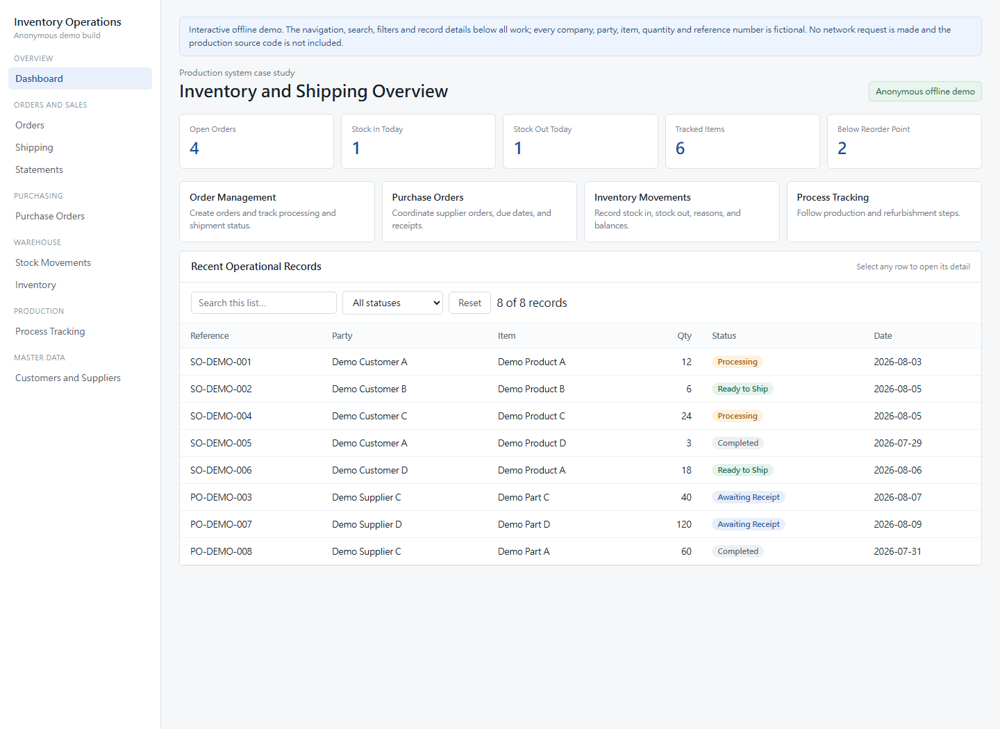

# Production Inventory Management System - Case Study

The image above is the actual Next.js application running in its anonymous demo mode. A simplified offline preview is also available in `demo.html`:

## Status

Deployed and used by a company. The complete source code and production configuration are private.

## Problem

The system coordinates sales orders, purchasing, inbound and outbound stock, shipping schedules, production steps, customer statements, and master data in one operational workflow.

## Engineering Scope

- Role-aware navigation and protected workflows
- Inventory movement and stock-level tracking
- Sales orders, purchase orders, shipping, and statements
- Product, part, customer, and supplier master data
- Process tracking and refurbishment workflows
- Printable operational documents and reports

## Application Modules

The production application contains more than twenty routed modules organized into functional areas:

| Area | Modules |
|------|---------|
| Orders and Sales | Orders, Shipping, Schedule, Statements, Renewals |
| Warehouse | Stock In, Stock In Query, Stock Out, Stock Out Query, Stock Out Reasons, Inventory, Inventory Query |
| Purchasing | Purchase Orders, Suppliers |
| Production | Process Steps, Process Tracking, Materials, Parts |
| Master Data | Products, Customers, Recipients |
| Documents | Printable purchase orders, sales invoices, and statement reports |

Each module includes list, create, and edit workflows with validation, and query modules provide filtered reporting views.

## Technical Summary

The private application uses Next.js, React, TypeScript, server-side actions, structured data access, and responsive operational interfaces.

## Public Demo

Open `demo.html`. It is interactive and offline: the sidebar switches between nine modules, every list supports search and filtering, and selecting a row opens its detail. Every company name, customer, supplier, item, quantity, and reference number is fictional.

## Why the Source Is Private

This repository intentionally excludes production code, business-specific rules, deployment history, credentials, databases, and company data. Additional source review can be discussed during an interview when appropriate and authorized.

